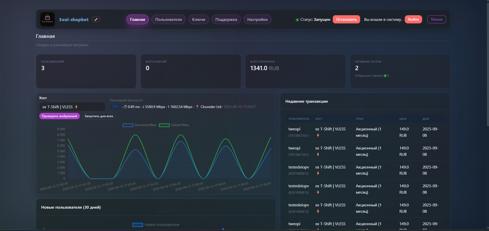
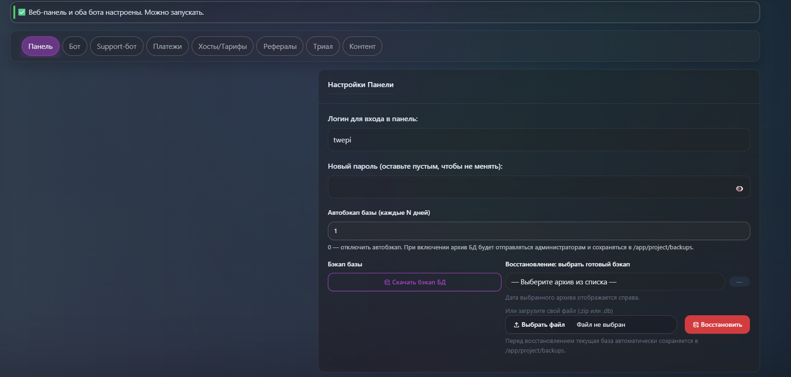
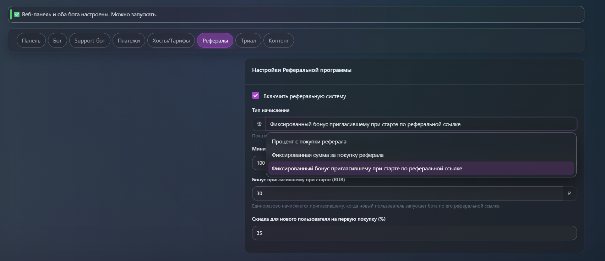
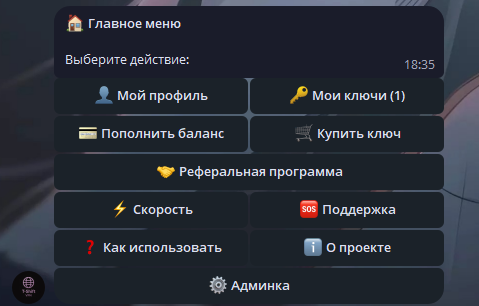
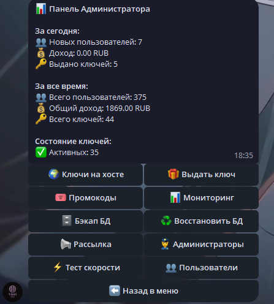
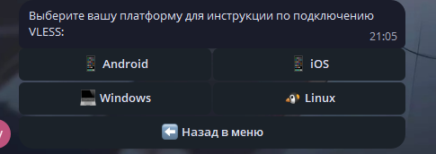

# Remnawave ShopBot

Remnawave ShopBot — это комплекс для автоматизации продажи VPN-конфигураций и управления клиентами. Решение включает Telegram-бота на базе Aiogram и веб-панель на Flask/Tabler, работает в связке с Remnawave Platform и поддерживает несколько способов оплаты.

## Основные возможности

- Полностью автоматизированная воронка: онбординг пользователя, проверка подписки и выдача конфигурации сразу после оплаты.
- Единая панель управления: управление хостами Remnawave Platform, тарифами, пользователями, платежами, журналами и спидтестами.
- Гибкая биллинг-модель: поддержка множества серверов, индивидуальных тарифов, пробных периодов и реферальных начислений.
- Интеграция с YooKassa, CryptoBot, Heleket и TON Connect, включая вебхуки и отправку чеков YooKassa.
- Построение отчётов и диагностика: принудительная подписка, встроенный саппорт, SSH/net-probe speedtest, мониторинг событий.

## Архитектура

- **Telegram-бот** — Aiogram 3, взаимодействует с пользователями и администраторами.
- **Веб-панель** — Flask + Jinja + Tabler UI, предоставляет интерфейс для управления платформой.
- **Бэкенд** — Python-сервисы внутри Docker-контейнера, взаимодействуют с Remnawave Platform и внешними API.
- **База данных** — SQLite, хранит настройки, тарифы, клиентов, историю платежей и логи.

## Требования

1. Сервер на Ubuntu/Debian с правами root и доступом по SSH.
2. Доменное имя с A-записью, указывающей на IP сервера.
3. Установленная Remnawave Platform на целевых хостах.
4. Telegram Bot Token, username бота и список администраторов.
5. Доступы к провайдерам оплаты (YooKassa, CryptoBot, Heleket, TON) при необходимости.

## Быстрый старт (автоустановка)

1. Подготовьте домен и убедитесь, что A-запись указывает на ваш сервер.
2. Запустите скрипт установки от имени пользователя с правами sudo:

   ```bash
   curl -sSL https://raw.githubusercontent.com/tweopi/remnawave-shopbot/main/install.sh | bash
   ```

3. Скрипт установит зависимости, выпустит сертификат Let's Encrypt, настроит Nginx и поднимет контейнеры.
4. После завершения панель будет доступна по адресу `https://<ваш-домен>:<порт>/login` (по умолчанию порт 8443).
5. Для первого входа используйте логин `admin` и пароль `admin`, затем сразу измените их в настройках.
6. В панели укажите токен Telegram-бота, username, ID владельца и запустите бота.

## Ручная установка и обновление

```bash
git clone https://github.com/tweopi/remnawave-shopbot.git
cd remnawave-shopbot
docker-compose up -d --build
```

- Для просмотра логов используйте `docker-compose logs -f`.
- Обновление выполняется командой `git pull --ff-only && docker-compose up -d --build`.
- Скрипт `install.sh` можно запускать повторно: при повторном запуске он выполнит только обновление контейнеров.

## Настройка вебхуков YooKassa

- Порт для вебхуков выбирается во время установки (443 или 8443).
- URL вебхука: `https://<ваш-домен>:<порт>/yookassa-webhook`.
- При использовании TON Connect укажите `ton_wallet_address` и `tonapi_key` в панели.

## Поддержка и сообщество

- Техническая поддержка: [t_shift_supportbot](https://t.me/t_shift_supportbot).
- Чат для интеграторов и администраторов: [@remnawave-shopbot](https://t.me/t_shift_supportbot).
- Наше комьюнити для обсуждений и обмена опытом.

## Вклад в проект

Будем рады вашим отчётам об ошибках и pull-request'ам. Используйте Issues GitHub для сообщений о багах и предложениях. Вы также можете поддержать разработку переводом по ссылке [ЮKassa](https://yookassa.ru/my/i/aJiSmSUeUie5/l).

## Лицензия

Проект распространяется по лицензии [GPLv3](LICENSE).

## Скриншоты

<details>
<summary>Панель и бот</summary>

| Панель — Дашборд | Панель — Настройки |
| --- | --- |
|  |  |
| Реферальные программы | Speedtest |
|  |  |
| Бот — главное меню | Бот — админ-меню |
|  |  |
| Бот — Настройки/Помощь |  |
|  |  |

</details>
